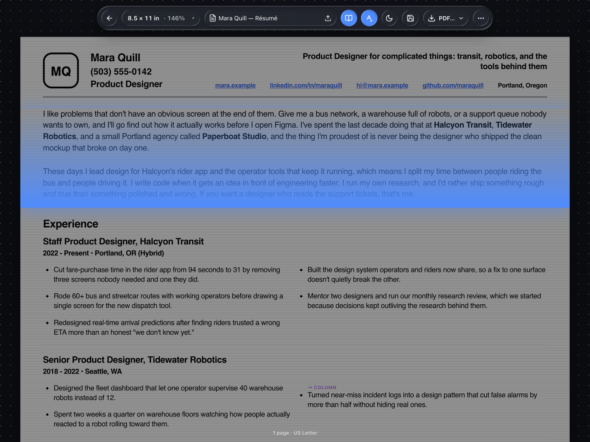

# CV Maker

**Your résumé is one HTML file. Open it, click any text, type — and export it as a real, ATS-readable document.**

CV Maker is an edit-in-place résumé editor that runs entirely in the browser. There's no form to fill in and no template gallery — your résumé shows up as a sheet of paper on a canvas, and every piece of copy is exactly where it'll be in the export, because you're editing the export. Click a line, it becomes a rich-text box with a floating format bar; click an image, swap it; done editing, export a PDF with real selectable text and live links, a Word file built for ATS parsing, a PNG, or the source HTML itself so you can keep variants.

- **Edit in place, not in a form.** Each `[data-cv-edit]` region in the template becomes a TipTap editor mounted directly on the template's own element — what you see while editing is what gets exported.
- **A format bar that follows you.** It appears just above the box you're editing (or below, if there's no room) with bold, italic, underline, font size in pt, weight, line height, letter spacing, a glass color picker, links, bullets, a horizontal rule, alignment, and clear formatting.
- **Job entries that flow.** A `.cv-flow` region's copy flows across two columns from one input, with an optional "start the next column here" break — so you type one job description and it lands where the design wants it.
- **Independent side-by-side columns** for skills or anything else that isn't one flowing story.
- **Add a row anywhere.** Hover between two blocks, click the **+**, and drop in a Content block, an Experience block, a Dual list, or a Divider — cloned from your document's own blocks, so it matches any template.
- **Move, duplicate, and delete any block** — click into it and a small tool pill appears beside it.
- **Swap any image** — click it, choose a file, and it's embedded straight into the document as a data URI. No uploads, no broken links later.
- **US Letter and A4**, switchable any time.
- **Fit to one page** scales the whole design down as a single unit (never below 80%) so every line still breaks exactly where it was designed to.
- **Pagination, your way.** On: real page breaks and centered page numbers once you're past one page. Off: one continuous page, no breaks.
- **Live zoom that tracks the window** — Fit width, Fit height, or a handful of fixed zoom levels.
- **Spellcheck toggle, light/dark theme**, and the same glass "look" system as Infospector (background pattern, colors, material and light — right-click the canvas).
- **Four export formats**: PDF (real text, real links), Word DOCX (native columns and tables, built for ATS parsing), PNG at 2×, and Source HTML — the one you reload to keep a variant.
- **Nothing leaves your browser.** Autosaves to `localStorage`. No server, no account, no analytics — unless you run the optional local export server yourself.


## Quick start

1. Copy this whole folder into your project's static directory, e.g. `public/labs/cv-maker/`.
2. Start your dev server the way you normally do.
3. Open `/labs/cv-maker/` — you'll land on the sample résumé (Mara Quill), ready to edit.

### Let your AI assistant install it

Paste this into Claude, Cursor, or whatever you use, from your project root:

> Install CV Maker (a static résumé editor) from this folder into my project. Read `INSTALL.md`
> in the `cv-maker` folder and follow it exactly — it's written as a checklist for you.

It'll detect your framework's static directory, copy the folder to the right place, verify it
serves, and ask you a short batch of questions (your own résumé as the starting template? US
Letter or A4? one-click PDF via the optional local server?) before it finishes.

## How it works

A résumé here is a single, self-contained HTML file — inline `<style>`, one `.cv-page` root, no
external CSS. The editor understands a handful of conventions in that file (see the comment at the
top of `templates/sample-resume.html` for the authoritative list):

```css
.cv-page { --cv-content-w: 562pt; font-size: 9pt; line-height: 1.15; }  /* everything scoped, sizes in pt */
.cv-page [data-col-break] { break-before: column; }                     /* where the editor may split a flow */
```

```html
<div data-cv-repeat="job">
  <div data-cv-keep-next class="cv-h2">Senior Designer — Studio Name</div>
  <div class="cv-flow" data-cv-edit>
    <p>Led the redesign of the core product, cutting onboarding time in half…</p>
  </div>
</div>
```

- `[data-cv-edit]` — an editable rich-text region (paragraphs, bullets, links, rules).
- `.cv-flow` — a region whose copy flows across columns from one input.
- `[data-cv-block]` — a unit pagination keeps together on one page.
- `[data-cv-keep-next]` — and keeps with the block that follows it (section headings).
- `[data-cv-repeat]` — a block you can duplicate, move, or delete (jobs).

The page size, page breaks, and page numbers belong to the editor, not to the file — your template
never sets a page height or draws its own footer number.


## Make your own template

1. Start from `templates/sample-resume.html` (the sample résumé, Mara Quill) and strip the content,
   keeping the structure and the conventions above.
2. Scope every rule under `.cv-page`, and use `pt` for every size — the editor's zoom and
   fit-to-page math assume it.
3. Mark your flowing sections (job descriptions, a long summary) with `.cv-flow` and
   `data-cv-edit`; mark repeatable sections (each job) with `data-cv-repeat`.
4. Load it from the toolbar (**⋯ → Load source HTML…**) to try it, then point `config.js`'s `home`
   at the file once you're happy.

What the editor owns: page size (US Letter / A4), page breaks, page numbers, zoom, and the overall
scale when fitting to one page. What your template owns: fonts, colors, spacing, and the actual
layout — columns, header, rules. The editor never rewrites your CSS; it only measures it.

## Exports



| Format | What you get | Needs a server? |
| --- | --- | --- |
| PDF | Real, selectable text and live links — ATS-readable | No — falls back to the browser's print dialog ("Save as PDF") |
| Word (DOCX) | Real paragraphs and bullets, native Word columns for flowing regions, borderless tables for side-by-side columns, hyperlinks, page-number footer | No — always renders in-browser |
| PNG (2×) | A flat image of the page, rasterized in-browser via `vendor/html-to-image.js` | No |
| Source HTML | The file itself, reloadable — how you keep variants | No |

A scan-line animation plays over the sheet while an export renders.

## Optional export server

Without a server, PDF export uses the browser's print dialog (still real text and links) and PNG
renders in-browser. If you'd rather get a one-click PDF or PNG straight out of headless Chrome:

```bash
npm i puppeteer      # not a dependency of this repo — install it yourself, next to server.mjs
node server.mjs       # http://127.0.0.1:7332
```

Then point `config.js` at it:

```js
window.CV_MAKER = {
    exportServer: "http://localhost:7332/export",
};
```

Without puppeteer installed, the server still starts and answers every `/export` request with
`501` and a message telling you to install it. Security properties: it binds to `127.0.0.1` only
(never all interfaces), its CORS allowlist only accepts `localhost` / `127.0.0.1` / `::1` origins,
and it renders your document with JavaScript disabled and all network requests blocked except
`data:`/`about:`/`blob:` — so nothing in your résumé can phone home during export.

## Desktop app (early)

`electron/` runs this same folder as a desktop app. Nothing in the editor knows it's there: the shell
serves the folder on its own `app://` origin and answers the editor's existing export-server option
itself, so **PDF and PNG are one click — no `server.mjs`, no puppeteer, no print dialog.**

**Download** an installer from [Releases](https://github.com/qmanning/cv-maker/releases) — macOS
(`…-mac-arm64.dmg` for Apple Silicon, `…-mac-x64.dmg` for Intel) or Windows — **or run it from source:**

```bash
cd electron
npm install
npm start
```

### First launch (the builds are unsigned)

CV Maker is free and I don't pay Apple or Microsoft for a signing certificate, so your computer will
ask you to vouch for the app once. If you'd rather not, use the [web version](https://qmanning.com/labs/cv-maker/demo)
or run it from source (above) — same editor, and neither shows a warning.

- **macOS** — open the disk image and **double-click CV Maker right there** (don't drag it anywhere; the window
  with the steps needs to stay in front of you). macOS says *"Apple could not verify “CV Maker” is free of
  malware that may harm your Mac or compromise your privacy."* Click **Done** (not *Move to Trash*; the dialog
  offers nothing else), then double-click **Open Privacy & Security** in that same window — or open **System
  Settings → Privacy & Security** yourself — scroll to the bottom, click **Open Anyway**, and confirm. CV Maker
  starts and offers to **install itself in Applications**: say yes. It copies itself there, reopens from
  Applications, and macOS doesn't ask again; eject the disk image. (If macOS says the app *"is damaged"*
  instead, run `xattr -cr` on the app in Terminal and open it again.)
- **Windows** — on *"Windows protected your PC"*, click **More info → Run anyway**.

Build the installers yourself with `npm run dist` (macOS) or `npm run dist:win`; pushing a `v*` tag
makes GitHub build both and attach them to a draft release. Unsigned also means no auto-update:
grab the next version from Releases.

Exports render in a throwaway window with JavaScript off and every network request refused, the same
posture as `server.mjs`. `npm run smoke` launches the app hidden, exports a PDF and a PNG through the
real UI, and — if puppeteer is resolvable (or `CVM_PUPPETEER_FROM=/path/with/node_modules`) — compares
the PDF with puppeteer's, text run by text run. It isn't signed or auto-updating yet.

**Connect the AI app you already use — no API key.** This is what the desktop app is for. CV Maker runs a
small [MCP](https://modelcontextprotocol.io) server, so your own AI app can read the résumé that's open and
change it while you watch: *"Tailor my résumé to this job description." "Tighten it to one page."* Every
change lands on the sheet as one step with **Undo** beside it.

- **One click to connect** (AI ▸ Connect Your AI…): **Claude Desktop**, and **the ChatGPT desktop app / Codex
  CLI / Codex IDE extension** (they share `~/.codex/config.toml`). CV Maker adds one entry to the app's
  settings file, keeps a backup next to it, and can remove it again. For **Claude Code, Cursor, VS Code,
  LM Studio** and anything else that speaks MCP there is a *Copy the settings* button.
- **No keys, no account, no network.** The AI app starts `electron/mcp/server.mjs` (dependency-free, run by
  CV Maker's own binary, so nobody needs Node) and that talks to the running app over a local socket only
  your user account can open. CV Maker itself never calls an AI service in this mode.
- **Four tools:** `get_resume`, `edit_resume`, `undo_last_edit`, `export_resume` (PDF / PNG to Downloads).
- **The design can't break.** The model never rewrites the file. It sees the résumé as addressable blocks
  and regions and answers with operations (set this text, add / duplicate / move / delete that block);
  the editor applies them, and every scrap of model-written HTML is parsed inertly and passed through an
  allowlist first (`src/cv-assistant.ts`). New blocks are cloned from your template's own.
- **It can see the page; the model can't.** `edit_resume` reports pages before and after, and tells the
  model to tighten up when an edit spills onto another page.
- It is told not to invent facts: if it needs something it doesn't have ("add my last job"), it asks.
- **Advanced — a prompt bar inside CV Maker.** If you'd rather type requests in the app, the same window
  lets you add a pay-as-you-go API key (Claude, OpenAI, Gemini, OpenRouter) or a local model (Ollama,
  LM Studio). The key is encrypted with the OS keychain, stays in the main process, and goes only to the
  provider you chose.

The web and drop-in builds don't show the prompt bar: there, point your own assistant at the `.html` file.

**Your résumé is a real file.** In the desktop app the document is one Source HTML file on disk —
**File → Open / Open Recent**, drop a file on the window, **Save** (⌘S) and **Save As** (⇧⌘S), an
edited dot in the title bar, and a prompt before closing with unsaved work. The app watches the open
file, so when something else edits it — your AI assistant, another editor — the sheet reloads by
itself (and asks first if you have unsaved edits of your own). That means the workflow you'd use in a
project works here too: point your assistant at the `.html` file and watch the page change.

## Configuration

Edit `config.js` (loaded as a classic script before the editor's own bundle):

| key | what |
| --- | --- |
| `home` | the source HTML the editor starts from (default: `templates/sample-resume.html`) |
| `exportServer` | a running `node server.mjs` endpoint for one-click PDF/PNG (see above) |
| `backHref` | shows a back arrow in the toolbar that navigates here |

Every key is optional — `window.CV_MAKER = {}` (or no `config.js` at all) is a valid install.

## The look


CV Maker wears [Infospector](https://github.com/qmanning/infospector)'s glass UI, vendored MIT
under `vendor/infospector/`, and shares its saved look through the same `pt:*` `localStorage` keys
— dial in a look in Infospector and it's the look here too, and vice versa. Right-click the canvas
for:

- **Background** — pattern (dots, grid, lines, none) and opacity.
- **Colors** — pattern, background, and accent, in HEX, RGB, HSL, or HSB.
- **Start-up** — paper size and the source page the editor opens with.
- **Material & Light** — radius, padding, blur, saturation, highlight, distance, opacity, backing,
  shine, shadow, and angle.

**Reset** returns to the shipped look; **Copy config** copies a snippet to paste into `config.js`
so every browser starts set up the same way; **Save** remembers it in this browser.

## Keyboard

| Keys | Does |
| --- | --- |
| `⌘S` / `Ctrl+S` | Save to this browser (`localStorage`) |
| `⌘B` / `Ctrl+B` | Bold |
| `⌘I` / `Ctrl+I` | Italic |
| `⌘U` / `Ctrl+U` | Underline |
| `Esc` | Closes any open menu, popover, or link editor |

## Privacy

Nothing is stored on or sent to a server. Your document autosaves to this browser's
`localStorage` only — export Source HTML to move it anywhere else, or hand a variant to someone
else as a file. The only network calls CV Maker ever makes on its own are to fetch the template
file it's pointed at; the optional export server (above) is one you run yourself, on your own
machine, and it blocks every outbound request during a render.

## Browser support & known limits

- **Chromium-based browsers recommended** (Chrome, Edge, Brave, Arc). CV Maker relies on CSS
  `zoom`, CSS multi-column layout, and the browser's print pipeline for PDF export; Safari and
  Firefox are untested.
- **DOCX can't be pixel-identical to the design.** It aims at a clean, ATS-readable structure —
  real paragraphs, native Word columns, borderless tables — not a visual clone of the PDF.
- **One document per browser.** CV Maker keeps a single autosaved document in `localStorage`; use
  Export → Source HTML to save named variants and Load source HTML to switch between them.
- **Fonts are whatever your template's font stack resolves to** on the machine viewing or
  exporting it. The sample template uses Helvetica/Arial, which every OS ships some version of.

## Developing

```bash
npm install
npm run build   # esbuild → dist/cv-maker.js + dist/cv-maker.css
npm test        # node --test, pure helpers in src/cv-source.ts
npm run serve   # static server on :7333, for local hacking against dist/
```

`src/` is kept byte-identical to how these files live in the author's own site, so they can be
re-synced by copying. That means two of their imports point at paths that don't exist in this
repo's layout — a Next.js `@/components/ui/…` alias, and a long relative import into
`public/labs/infospector/`. `build.mjs` remaps both at resolve time with an esbuild plugin instead
of editing the source files, so don't "fix" those imports; they're intentional.

`vendor/infospector/` is a verbatim copy of Infospector's `host.css`, `lib.js`, and
`colorpicker.js`. If Infospector changes upstream, re-copy those three files (and its `LICENSE`)
rather than editing them here — a comment at the top of `vendor/infospector/README.md` says the
same.

## Credits

- [Infospector](https://github.com/qmanning/infospector) — the glass UI CV Maker wears (MIT, same author).
- [TipTap](https://tiptap.dev) / [ProseMirror](https://prosemirror.net) — the rich-text editing underneath every region (MIT).
- [docx](https://github.com/dolanmiu/docx) — the DOCX export (MIT).
- [html-to-image](https://github.com/bubkoo/html-to-image) — the in-browser PNG fallback (MIT).
- [lucide](https://lucide.dev) — icons, via `lucide-react` (ISC).

## License

MIT © 2026 Q Manning. See [LICENSE](./LICENSE).

---

Made by [Q Manning](https://qmanning.com) · [Source on GitHub](https://github.com/qmanning/cv-maker) · [See it live in the Labs](https://qmanning.com/labs/cv-maker)
